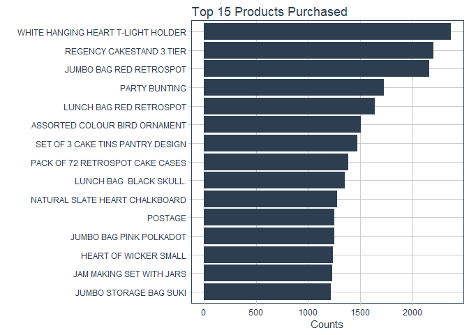

Market Basket Analysis
================

Libraries
=========

``` r
library(readxl)
library(tidyverse)
library(lubridate)
library(arules)
library(arulesViz)
library(tidyquant)
library(plotly)
```

Data
====

We will use the Online Retail data available at \[UCI repository\] (<https://archive.ics.uci.edu/ml/datasets/online+retail>).

``` r
retails_df <- read_excel("Online Retail.xlsx")

head(retails_df,10) %>% knitr::kable()
```

| InvoiceNo | StockCode | Description                         |  Quantity| InvoiceDate         |  UnitPrice|  CustomerID| Country        |
|:----------|:----------|:------------------------------------|---------:|:--------------------|----------:|-----------:|:---------------|
| 536365    | 85123A    | WHITE HANGING HEART T-LIGHT HOLDER  |         6| 2010-12-01 08:26:00 |       2.55|       17850| United Kingdom |
| 536365    | 71053     | WHITE METAL LANTERN                 |         6| 2010-12-01 08:26:00 |       3.39|       17850| United Kingdom |
| 536365    | 84406B    | CREAM CUPID HEARTS COAT HANGER      |         8| 2010-12-01 08:26:00 |       2.75|       17850| United Kingdom |
| 536365    | 84029G    | KNITTED UNION FLAG HOT WATER BOTTLE |         6| 2010-12-01 08:26:00 |       3.39|       17850| United Kingdom |
| 536365    | 84029E    | RED WOOLLY HOTTIE WHITE HEART.      |         6| 2010-12-01 08:26:00 |       3.39|       17850| United Kingdom |
| 536365    | 22752     | SET 7 BABUSHKA NESTING BOXES        |         2| 2010-12-01 08:26:00 |       7.65|       17850| United Kingdom |
| 536365    | 21730     | GLASS STAR FROSTED T-LIGHT HOLDER   |         6| 2010-12-01 08:26:00 |       4.25|       17850| United Kingdom |
| 536366    | 22633     | HAND WARMER UNION JACK              |         6| 2010-12-01 08:28:00 |       1.85|       17850| United Kingdom |
| 536366    | 22632     | HAND WARMER RED POLKA DOT           |         6| 2010-12-01 08:28:00 |       1.85|       17850| United Kingdom |
| 536367    | 84879     | ASSORTED COLOUR BIRD ORNAMENT       |        32| 2010-12-01 08:34:00 |       1.69|       13047| United Kingdom |

EDA
===

We will first have a look at the data before we do the analysis.

**Most Purchased Items**

``` r
theme_set(theme_tq())

retails_df %>% 
  dplyr::count(Description, sort = TRUE) %>% 
  drop_na() %>% 
  head(15) %>% 
  ggplot(aes(x = reorder(Description,n), y = n))+
  geom_col(aes(fill = 'blue'), show.legend = FALSE)+
  coord_flip()+
  labs(title = "Top 15 Products Purchased",x = "", y = "Counts")+
  scale_fill_tq()
```



**Summary of Items purchased per transaction**

``` r
retails_df %>% 
  count(InvoiceNo, sort = T) %>% 
  summarise_at(vars(n), funs(mean, median, min, max))
```

    ## # A tibble: 1 x 4
    ##    mean median   min   max
    ##   <dbl>  <dbl> <dbl> <dbl>
    ## 1  20.9     10     1  1114

**Average itmes purchased per transaction by country**

``` r
 retails_df %>% 
  count(InvoiceNo, Country) %>% 
  group_by(Country) %>% 
  summarise(total_trans = n(),
            total_items = sum(n)) %>% 
  mutate(avg_items_per_trans = total_items/total_trans,
         Country = fct_reorder(Country,avg_items_per_trans)) %>%
  ggplot(aes(x = Country,y = avg_items_per_trans))+
  geom_col(aes(fill = 'blue'), show.legend = FALSE)+
  coord_flip()+
  labs(title = "Average items purchased per transaction by Country",
       x = "", y = "Average items Purchased")+
  scale_fill_tq()
```


**What time of the day most purchase take place..**

``` r
 retails_df %>% 
  mutate(hr_day = hour(InvoiceDate)) %>% 
  group_by(InvoiceNo) %>% 
  slice(1) %>% 
  ungroup() %>% 
  mutate(hr_day = as.factor(hr_day)) %>% 
  ggplot(aes(x = hr_day))+
  geom_bar(aes(fill = 'blue'), show.legend = FALSE)+
  labs(title = "Distribution of Hour of Transaction", x = 'Hour of Day',
       y = "Transactions")+
  scale_fill_tq()
```


Preprocessing Data
==================

Our data is currently in data frame format, but we need the data in 'transactions' format to perform market basket anaysis with arules package.

**Preparing data in the transactions format for association rules analysis**

``` r
library(plyr)

retails_transactions <- ddply(.data = retails_df, 
                              .variables = c('InvoiceNo'),
                              .fun = function(df)paste(df$Description, collapse = ",")
                               )


retails_transactions %>% head() %>% knitr::kable()
```

| InvoiceNo | V1                                                                                                                                                                                                                                                                                                                                                                                                                                                                                                                                        |
|:----------|:------------------------------------------------------------------------------------------------------------------------------------------------------------------------------------------------------------------------------------------------------------------------------------------------------------------------------------------------------------------------------------------------------------------------------------------------------------------------------------------------------------------------------------------|
| 536365    | WHITE HANGING HEART T-LIGHT HOLDER,WHITE METAL LANTERN,CREAM CUPID HEARTS COAT HANGER,KNITTED UNION FLAG HOT WATER BOTTLE,RED WOOLLY HOTTIE WHITE HEART.,SET 7 BABUSHKA NESTING BOXES,GLASS STAR FROSTED T-LIGHT HOLDER                                                                                                                                                                                                                                                                                                                   |
| 536366    | HAND WARMER UNION JACK,HAND WARMER RED POLKA DOT                                                                                                                                                                                                                                                                                                                                                                                                                                                                                          |
| 536367    | ASSORTED COLOUR BIRD ORNAMENT,POPPY'S PLAYHOUSE BEDROOM,POPPY'S PLAYHOUSE KITCHEN,FELTCRAFT PRINCESS CHARLOTTE DOLL,IVORY KNITTED MUG COSY,BOX OF 6 ASSORTED COLOUR TEASPOONS,BOX OF VINTAGE JIGSAW BLOCKS,BOX OF VINTAGE ALPHABET BLOCKS,HOME BUILDING BLOCK WORD,LOVE BUILDING BLOCK WORD,RECIPE BOX WITH METAL HEART,DOORMAT NEW ENGLAND                                                                                                                                                                                               |
| 536368    | JAM MAKING SET WITH JARS,RED COAT RACK PARIS FASHION,YELLOW COAT RACK PARIS FASHION,BLUE COAT RACK PARIS FASHION                                                                                                                                                                                                                                                                                                                                                                                                                          |
| 536369    | BATH BUILDING BLOCK WORD                                                                                                                                                                                                                                                                                                                                                                                                                                                                                                                  |
| 536370    | ALARM CLOCK BAKELIKE PINK,ALARM CLOCK BAKELIKE RED,ALARM CLOCK BAKELIKE GREEN,PANDA AND BUNNIES STICKER SHEET,STARS GIFT TAPE,INFLATABLE POLITICAL GLOBE,VINTAGE HEADS AND TAILS CARD GAME,SET/2 RED RETROSPOT TEA TOWELS,ROUND SNACK BOXES SET OF4 WOODLAND,SPACEBOY LUNCH BOX,LUNCH BOX I LOVE LONDON,CIRCUS PARADE LUNCH BOX,CHARLOTTE BAG DOLLY GIRL DESIGN,RED TOADSTOOL LED NIGHT LIGHT,SET 2 TEA TOWELS I LOVE LONDON,VINTAGE SEASIDE JIGSAW PUZZLES,MINI JIGSAW CIRCUS PARADE,MINI JIGSAW SPACEBOY,MINI PAINT SET VINTAGE,POSTAGE |

We can see now the data is arranged in transaction format where each row represents a transaction. For further analysis we will only need the coulumn that contains the items purchased and each item in the coulmn represents a tansaction.

**Saving the transaction data**

``` r
transactions <- retails_transactions %>% 
  dplyr::rename(items = V1) %>% 
  select(items) 

write.csv(transactions,"transactions.csv",quote = FALSE, row.names = FALSE )
```

**Read the transactions data that we just saved for rule mining**

``` r
tr <- read.transactions("transactions.csv",format = 'basket',
                               sep = ",", rm.duplicates = TRUE, skip = 1)
```

    ## distribution of transactions with duplicates:
    ## items
    ##    1    2    3    4    5    6    7    8    9   10   11   12   13   14   15 
    ## 1151  584  297  195  122  109   67   50   31   34   20   18   14    8    6 
    ##   16   17   18   19   20   21   22   23   24   25   26   37   38 
    ##    5   12    4    4    3    1    1    3    3    2    1    2    1

``` r
tr
```

    ## transactions in sparse format with
    ##  25900 transactions (rows) and
    ##  8978 items (columns)

``` r
summary(tr)
```

    ## transactions as itemMatrix in sparse format with
    ##  25900 rows (elements/itemsets/transactions) and
    ##  8978 columns (items) and a density of 0.001815558 
    ## 
    ## most frequent items:
    ## WHITE HANGING HEART T-LIGHT HOLDER           REGENCY CAKESTAND 3 TIER 
    ##                               1969                               1883 
    ##            JUMBO BAG RED RETROSPOT                      PARTY BUNTING 
    ##                               1736                               1464 
    ##            LUNCH BAG RED RETROSPOT                            (Other) 
    ##                               1382                             413738 
    ## 
    ## element (itemset/transaction) length distribution:
    ## sizes
    ##    0    1    2    3    4    5    6    7    8    9   10   11   12   13   14 
    ## 1454 4598 1741 1214  952  895  785  718  700  683  615  644  547  529  547 
    ##   15   16   17   18   19   20   21   22   23   24   25   26   27   28   29 
    ##  561  536  480  457  494  433  406  329  316  286  249  262  235  224  231 
    ##   30   31   32   33   34   35   36   37   38   39   40   41   42   43   44 
    ##  221  171  172  146  148  140  118  120  101  116  100   95   97   94   72 
    ##   45   46   47   48   49   50   51   52   53   54   55   56   57   58   59 
    ##   72   73   69   69   64   54   67   46   52   55   52   39   33   44   37 
    ##   60   61   62   63   64   65   66   67   68   69   70   71   72   73   74 
    ##   31   34   20   26   27   23   31   26   27   19   22   21   15   17   23 
    ##   75   76   77   78   79   80   81   82   83   84   85   86   87   88   89 
    ##   11   16   14   12   10   18   18   15    8    9   15   14   16   11    8 
    ##   90   91   92   93   94   95   96   97   98   99  100  101  102  103  104 
    ##    8   12   12    8    7    7    4    8    9    4    8    6    4    5    6 
    ##  105  106  107  108  109  110  111  112  113  114  116  117  118  119  120 
    ##    2    3    7    9    4    8    4    2    7    1    4    6    5    1    3 
    ##  121  122  123  124  125  126  127  128  129  130  131  132  133  134  135 
    ##    6    4    3    2    5    5    2    1    1    4    3    5    5    2    4 
    ##  136  137  138  139  140  141  142  143  144  145  146  147  148  150  151 
    ##    3    1    1    1    3    7    5    3    3    4    7    2    3    3    3 
    ##  152  153  154  155  156  157  158  159  160  162  163  164  167  168  169 
    ##    2    4    7    3    3    5    1    4    5    1    2    2    3    4    2 
    ##  170  171  172  173  174  175  176  177  178  179  180  181  182  183  184 
    ##    2    3    2    1    3    5    1    1    4    3    2    1    1    1    2 
    ##  185  186  187  189  192  193  194  196  197  198  201  202  204  205  206 
    ##    1    1    2    2    1    4    1    3    3    1    1    1    2    1    1 
    ##  207  208  209  212  213  215  217  219  220  224  226  227  228  230  232 
    ##    2    3    2    1    1    2    1    3    1    3    3    1    1    2    1 
    ##  234  236  238  240  241  248  249  250  252  256  257  258  260  261  263 
    ##    1    1    2    1    2    1    1    2    1    1    1    1    2    1    1 
    ##  265  266  270  272  274  281  284  285  291  298  301  303  305  312  314 
    ##    1    1    1    1    1    1    1    1    1    1    1    1    2    2    1 
    ##  320  321  326  327  329  332  338  339  344  348  350  360  365  367  375 
    ##    2    1    1    1    1    1    1    1    2    1    1    2    1    1    3 
    ##  391  394  398  400  402  411  419  429  431  442  447  460  468  471  477 
    ##    1    1    2    1    1    1    2    1    1    1    1    1    1    1    1 
    ##  509  514  530  587  640 
    ##    1    1    1    1    1 
    ## 
    ##    Min. 1st Qu.  Median    Mean 3rd Qu.    Max. 
    ##     0.0     2.0     8.0    16.3    20.0   640.0 
    ## 
    ## includes extended item information - examples:
    ##                    labels
    ## 1   *Boombox Ipod Classic
    ## 2 *USB Office Mirror Ball
    ## 3                       ?

Inspect few of the transactions

``` r
inspect(head(tr))
```

    ##     items                                              
    ## [1] {CREAM CUPID HEARTS COAT HANGER,                   
    ##      GLASS STAR FROSTED T-LIGHT HOLDER,                
    ##      KNITTED UNION FLAG HOT WATER BOTTLE,              
    ##      RED WOOLLY HOTTIE WHITE HEART.,                   
    ##      SET 7 BABUSHKA NESTING BOXES,                     
    ##      WHITE HANGING HEART T-LIGHT HOLDER,               
    ##      WHITE METAL LANTERN}                              
    ## [2] {HAND WARMER RED POLKA DOT,                        
    ##      HAND WARMER UNION JACK}                           
    ## [3] {ASSORTED COLOUR BIRD ORNAMENT,                    
    ##      BOX OF 6 ASSORTED COLOUR TEASPOONS,               
    ##      BOX OF VINTAGE ALPHABET BLOCKS,                   
    ##      BOX OF VINTAGE JIGSAW BLOCKS,                     
    ##      DOORMAT NEW ENGLAND,                              
    ##      FELTCRAFT PRINCESS CHARLOTTE DOLL,                
    ##      HOME BUILDING BLOCK WORD,                         
    ##      IVORY KNITTED MUG COSY,                           
    ##      LOVE BUILDING BLOCK WORD,                         
    ##      POPPYS PLAYHOUSE BEDROOM,POPPYS PLAYHOUSE KITCHEN,
    ##      RECIPE BOX WITH METAL HEART}                      
    ## [4] {BLUE COAT RACK PARIS FASHION,                     
    ##      JAM MAKING SET WITH JARS,                         
    ##      RED COAT RACK PARIS FASHION,                      
    ##      YELLOW COAT RACK PARIS FASHION}                   
    ## [5] {BATH BUILDING BLOCK WORD}                         
    ## [6] {ALARM CLOCK BAKELIKE GREEN,                       
    ##      ALARM CLOCK BAKELIKE PINK,                        
    ##      ALARM CLOCK BAKELIKE RED,                         
    ##      CHARLOTTE BAG DOLLY GIRL DESIGN,                  
    ##      CIRCUS PARADE LUNCH BOX,                          
    ##      INFLATABLE POLITICAL GLOBE,                       
    ##      LUNCH BOX I LOVE LONDON,                          
    ##      MINI JIGSAW CIRCUS PARADE,                        
    ##      MINI JIGSAW SPACEBOY,                             
    ##      MINI PAINT SET VINTAGE,                           
    ##      PANDA AND BUNNIES STICKER SHEET,                  
    ##      POSTAGE,                                          
    ##      RED TOADSTOOL LED NIGHT LIGHT,                    
    ##      ROUND SNACK BOXES SET OF4 WOODLAND,               
    ##      SET 2 TEA TOWELS I LOVE LONDON,                   
    ##      SET/2 RED RETROSPOT TEA TOWELS,                   
    ##      SPACEBOY LUNCH BOX,                               
    ##      STARS GIFT TAPE,                                  
    ##      VINTAGE HEADS AND TAILS CARD GAME,                
    ##      VINTAGE SEASIDE JIGSAW PUZZLES}

\*\* TOp 10 frequent items in the transactions\*\*

``` r
itemFrequencyPlot(tr,topN = 10, type = "absolute", horiz = TRUE, col = "blue")
```


Generating Rules
================

``` r
rules <- apriori(tr, parameter = list(support = 0.009,  confidence = 0.7, 
                                             maxlen = 4) )
```

    ## Apriori
    ## 
    ## Parameter specification:
    ##  confidence minval smax arem  aval originalSupport maxtime support minlen
    ##         0.7    0.1    1 none FALSE            TRUE       5   0.009      1
    ##  maxlen target   ext
    ##       4  rules FALSE
    ## 
    ## Algorithmic control:
    ##  filter tree heap memopt load sort verbose
    ##     0.1 TRUE TRUE  FALSE TRUE    2    TRUE
    ## 
    ## Absolute minimum support count: 233 
    ## 
    ## set item appearances ...[0 item(s)] done [0.00s].
    ## set transactions ...[8978 item(s), 25900 transaction(s)] done [0.04s].
    ## sorting and recoding items ... [490 item(s)] done [0.02s].
    ## creating transaction tree ... done [0.00s].
    ## checking subsets of size 1 2 3 4 done [0.04s].
    ## writing ... [33 rule(s)] done [0.00s].
    ## creating S4 object  ... done [0.00s].

``` r
summary(rules)
```

    ## set of 33 rules
    ## 
    ## rule length distribution (lhs + rhs):sizes
    ##  2  3  4 
    ## 16 14  3 
    ## 
    ##    Min. 1st Qu.  Median    Mean 3rd Qu.    Max. 
    ##   2.000   2.000   3.000   2.606   3.000   4.000 
    ## 
    ## summary of quality measures:
    ##     support           confidence          lift           count      
    ##  Min.   :0.009189   Min.   :0.7274   Min.   :10.98   Min.   :238.0  
    ##  1st Qu.:0.009923   1st Qu.:0.7494   1st Qu.:23.32   1st Qu.:257.0  
    ##  Median :0.012934   Median :0.8114   Median :26.39   Median :335.0  
    ##  Mean   :0.013141   Mean   :0.8503   Mean   :38.98   Mean   :340.4  
    ##  3rd Qu.:0.014131   3rd Qu.:1.0000   3rd Qu.:56.67   3rd Qu.:366.0  
    ##  Max.   :0.025058   Max.   :1.0000   Max.   :70.77   Max.   :649.0  
    ## 
    ## mining info:
    ##  data ntransactions support confidence
    ##    tr         25900   0.009        0.7

**Inspecting the rules**

``` r
inspect(head(rules))
```

    ##     lhs                      rhs                   support    confidence
    ## [1] {BACK DOOR}           => {KEY FOB}             0.00957529 1.0000000 
    ## [2] {SUGAR}               => {SET 3 RETROSPOT TEA} 0.01413127 1.0000000 
    ## [3] {SET 3 RETROSPOT TEA} => {SUGAR}               0.01413127 1.0000000 
    ## [4] {SUGAR}               => {COFFEE}              0.01413127 1.0000000 
    ## [5] {COFFEE}              => {SUGAR}               0.01413127 0.8008753 
    ## [6] {SET 3 RETROSPOT TEA} => {COFFEE}              0.01413127 1.0000000 
    ##     lift     count
    ## [1] 61.52019 248  
    ## [2] 70.76503 366  
    ## [3] 70.76503 366  
    ## [4] 56.67396 366  
    ## [5] 56.67396 366  
    ## [6] 56.67396 366

**Removing Redundant rules**

``` r
# reduntand rules

inspect(rules[is.redundant(rules)])
```

    ##     lhs                             rhs                   support   
    ## [1] {SET 3 RETROSPOT TEA,SUGAR}  => {COFFEE}              0.01413127
    ## [2] {COFFEE,SUGAR}               => {SET 3 RETROSPOT TEA} 0.01413127
    ## [3] {COFFEE,SET 3 RETROSPOT TEA} => {SUGAR}               0.01413127
    ##     confidence lift     count
    ## [1] 1          56.67396 366  
    ## [2] 1          70.76503 366  
    ## [3] 1          70.76503 366

``` r
# Removing redundant rules

rules <- rules[!is.redundant(rules)]
```

**Top 10 Rules bsed on the lift**

``` r
top_rules <- sort(rules, by = 'lift', decreasing = TRUE)[1:10]

inspect(top_rules)
```

    ##      lhs                               rhs                                      support confidence     lift count
    ## [1]  {SUGAR}                        => {SET 3 RETROSPOT TEA}                0.014131274  1.0000000 70.76503   366
    ## [2]  {SET 3 RETROSPOT TEA}          => {SUGAR}                              0.014131274  1.0000000 70.76503   366
    ## [3]  {BACK DOOR}                    => {KEY FOB}                            0.009575290  1.0000000 61.52019   248
    ## [4]  {SHED}                         => {KEY FOB}                            0.011235521  1.0000000 61.52019   291
    ## [5]  {REGENCY TEA PLATE GREEN}      => {REGENCY TEA PLATE ROSES}            0.009922780  0.8290323 57.87584   257
    ## [6]  {SUGAR}                        => {COFFEE}                             0.014131274  1.0000000 56.67396   366
    ## [7]  {SET 3 RETROSPOT TEA}          => {COFFEE}                             0.014131274  1.0000000 56.67396   366
    ## [8]  {COFFEE}                       => {SUGAR}                              0.014131274  0.8008753 56.67396   366
    ## [9]  {COFFEE}                       => {SET 3 RETROSPOT TEA}                0.014131274  0.8008753 56.67396   366
    ## [10] {SMALL MARSHMALLOWS PINK BOWL} => {SMALL DOLLY MIX DESIGN ORANGE BOWL} 0.009305019  0.7578616 52.90732   241

**What are the products influencing sugar purchase?**

``` r
sugar_rules <- apriori(tr, parameter = list(support = 0.009, confidence = 0.7),
                       appearance = list(default = 'lhs', rhs = 'SUGAR'))
```

    ## Apriori
    ## 
    ## Parameter specification:
    ##  confidence minval smax arem  aval originalSupport maxtime support minlen
    ##         0.7    0.1    1 none FALSE            TRUE       5   0.009      1
    ##  maxlen target   ext
    ##      10  rules FALSE
    ## 
    ## Algorithmic control:
    ##  filter tree heap memopt load sort verbose
    ##     0.1 TRUE TRUE  FALSE TRUE    2    TRUE
    ## 
    ## Absolute minimum support count: 233 
    ## 
    ## set item appearances ...[1 item(s)] done [0.00s].
    ## set transactions ...[8978 item(s), 25900 transaction(s)] done [0.05s].
    ## sorting and recoding items ... [490 item(s)] done [0.02s].
    ## creating transaction tree ... done [0.00s].
    ## checking subsets of size 1 2 3 4 done [0.02s].
    ## writing ... [3 rule(s)] done [0.00s].
    ## creating S4 object  ... done [0.00s].

``` r
inspect(sort(sugar_rules, by = 'lift', decreasing = TRUE))
```

    ##     lhs                             rhs     support    confidence lift    
    ## [1] {SET 3 RETROSPOT TEA}        => {SUGAR} 0.01413127 1.0000000  70.76503
    ## [2] {COFFEE,SET 3 RETROSPOT TEA} => {SUGAR} 0.01413127 1.0000000  70.76503
    ## [3] {COFFEE}                     => {SUGAR} 0.01413127 0.8008753  56.67396
    ##     count
    ## [1] 366  
    ## [2] 366  
    ## [3] 366

**What products are purchased with sugar?**

``` r
with_sugar <- apriori(tr, parameter = list(support = 0.009, confidence = 0.7),
                       appearance = list(default = 'rhs', lhs = 'SUGAR'))
```

    ## Apriori
    ## 
    ## Parameter specification:
    ##  confidence minval smax arem  aval originalSupport maxtime support minlen
    ##         0.7    0.1    1 none FALSE            TRUE       5   0.009      1
    ##  maxlen target   ext
    ##      10  rules FALSE
    ## 
    ## Algorithmic control:
    ##  filter tree heap memopt load sort verbose
    ##     0.1 TRUE TRUE  FALSE TRUE    2    TRUE
    ## 
    ## Absolute minimum support count: 233 
    ## 
    ## set item appearances ...[1 item(s)] done [0.00s].
    ## set transactions ...[8978 item(s), 25900 transaction(s)] done [0.04s].
    ## sorting and recoding items ... [490 item(s)] done [0.02s].
    ## creating transaction tree ... done [0.00s].
    ## checking subsets of size 1 2 done [0.00s].
    ## writing ... [2 rule(s)] done [0.00s].
    ## creating S4 object  ... done [0.00s].

``` r
 inspect(sort(with_sugar, by = 'lift', decreasing = TRUE))
```

    ##     lhs        rhs                   support    confidence lift     count
    ## [1] {SUGAR} => {SET 3 RETROSPOT TEA} 0.01413127 1          70.76503 366  
    ## [2] {SUGAR} => {COFFEE}              0.01413127 1          56.67396 366

Visualization
=============

**Scatter plot of all rules**

``` r
plot(rules)
```


**Network Plot for top 10 rules**

``` r
plot(top_rules, method = 'graph')
```


